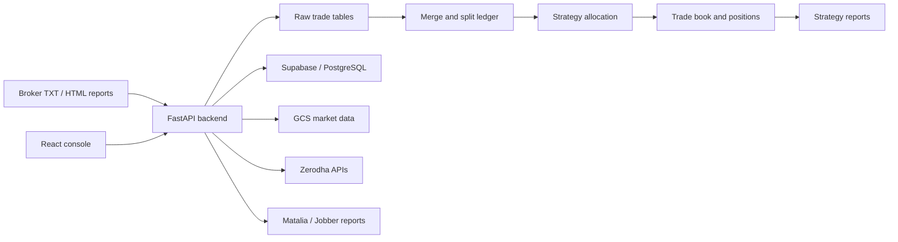

# Architecture

## Overview

Prop Accounting Engine is split into two cooperating applications:

1. **FastAPI backend** — owns integrations, transformations, ledger writes, workflow orchestration, and reporting responses.
2. **React frontend** — owns navigation, workflow controls, tables, filters, charts, and operator feedback.

## Runtime boundaries

### Frontend

- Runs through Vite during development.
- Defaults to `http://localhost:8001` for the backend.
- Uses a lightweight pathname router in `src/lib/router.tsx`.
- Uses typed request helpers in `src/lib/api.ts`.
- Does not directly access credentials or databases.

### Backend

- Starts at `backend.main:app`.
- Loads `backend/.env` through `python-dotenv`.
- Dynamically imports numbered workflow modules because their filenames begin with digits.
- Restricts CORS to local development origins.
- Writes pipeline activity to the ignored runtime-log directory.

### External systems

| System | Responsibility |
| --- | --- |
| Supabase/PostgreSQL | Trade ledger, strategy master, allocations, positions, and charges. |
| Google Cloud Storage | Market-data and instrument assets. |
| Zerodha/Kite | Authentication, instrument catalogue, live prices, and market stream. |
| Matalia/Jobber | Daily charges/report retrieval through browser automation. |

## Core workflow

### Import and accounting pipeline

1. Operator selects a source TXT file in the frontend.
2. Backend validates and stores raw trade rows.
3. Merge logic groups compatible executions into logical trades.
4. Split logic divides quantities when one execution belongs to multiple accounting units.
5. Strategy allocation assigns strategy, account, and position context.
6. Confirmed allocations populate the trade book and position views.
7. Reports aggregate the resulting ledger.

### Live-price workflow

1. Frontend requests a Zerodha status or login URL.
2. Backend validates credentials or completes token exchange.
3. Instruments are resolved against the local/GCS instrument catalogue.
4. Live prices refresh open positions.
5. CMP values are persisted for the open-trade view.

### Charges workflow

1. Operator selects a date range.
2. Backend starts a monitored Playwright fetch.
3. CAPTCHA, when required, is returned to the frontend.
4. Parsed daily charge rows are upserted into PostgreSQL.
5. The charges page loads stored results and fetch status.

## Data ownership

- **Source files:** local operator input; ignored from Git.
- **Raw trades:** database-backed and immutable in lineage terms.
- **Merged/split records:** workflow state derived from raw trades.
- **Strategy allocation:** operator-confirmed business state.
- **Reports:** read models derived from the ledger.
- **Logs:** local diagnostics only; not a source of truth.
